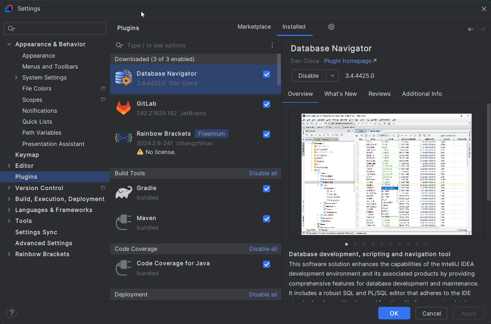
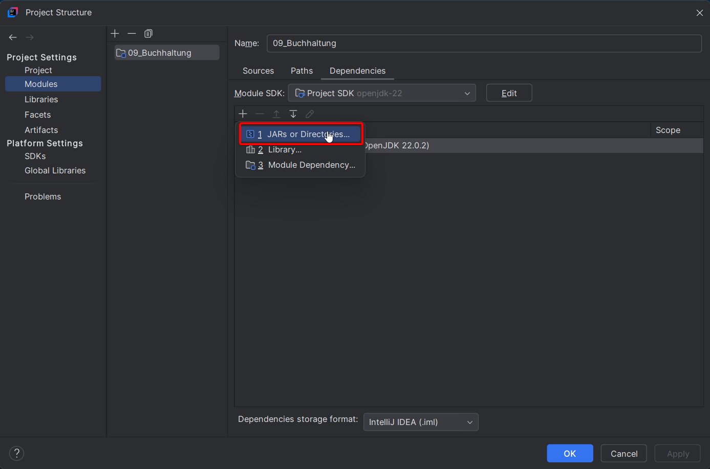
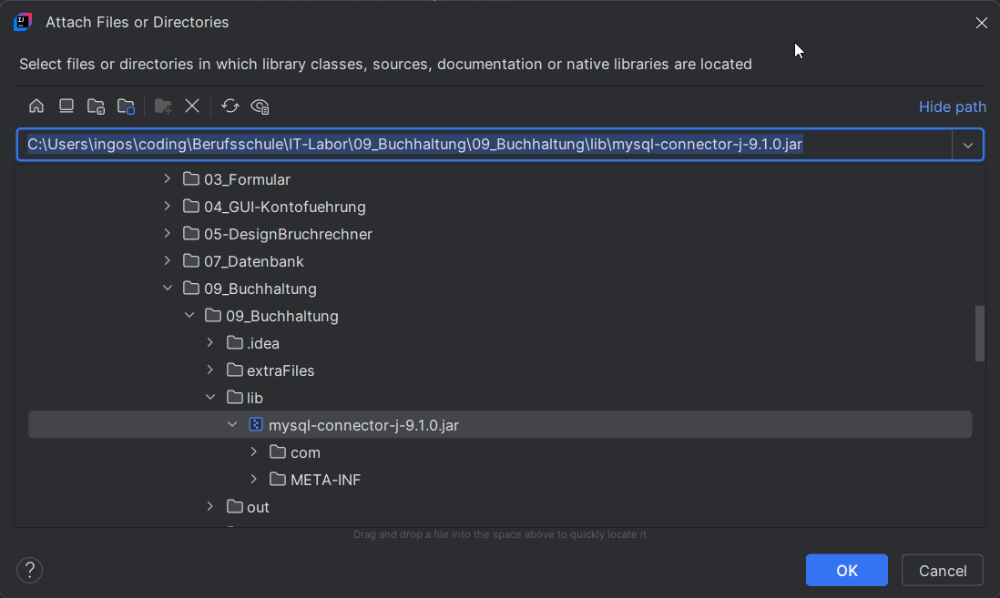
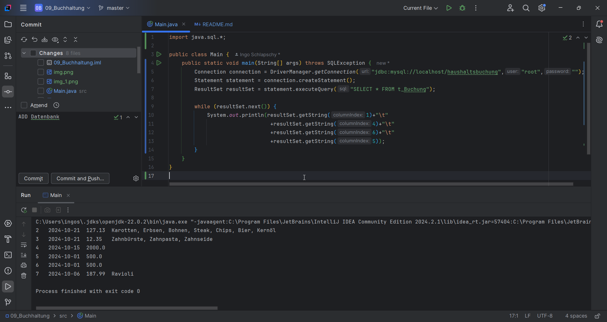
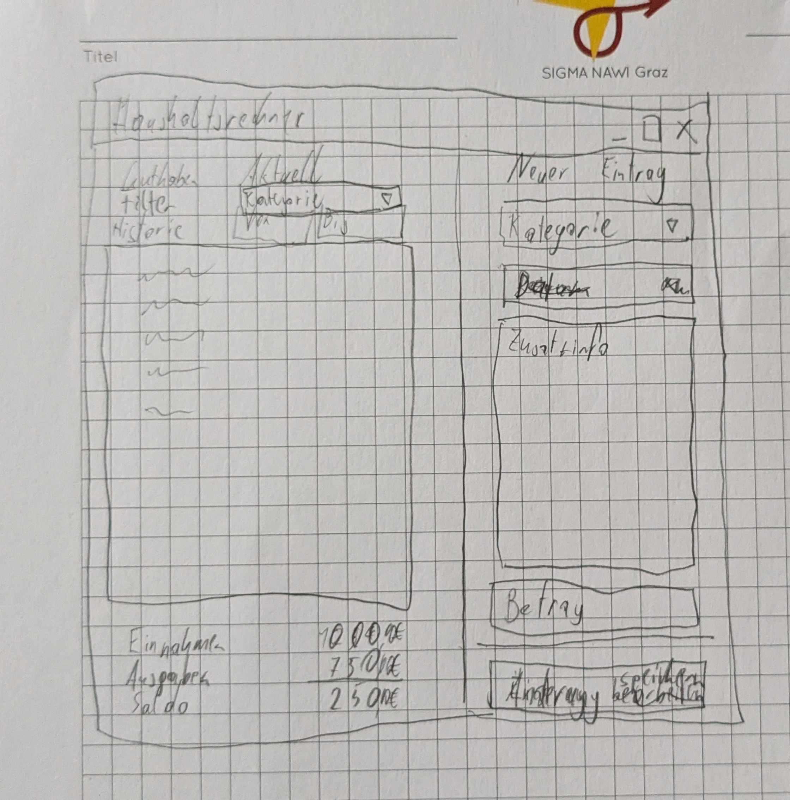
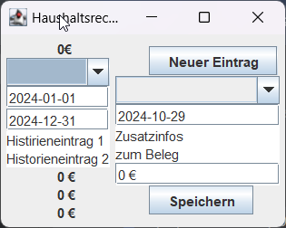

# Angabe
- [Link zur Angabe](https://www.eduvidual.at/mod/assign/view.php?id=6290148)
```
    1. Lernziele
    • Erstelle eine einfache Haushaltskosten App (Einnahmen-/Ausgabenrechner) mit Datenbank
    • Klassenstruktur planen
    • Umsetzung in JAVA

    2. Aufgabenstellung
    • Wie sieht die Datenbankstruktur aus?
    • Wie wird die Oberfläche gestaltet?
    • Welche Klassen werden benötigt?
    • Welche Methoden werden in der Klasse benötigt?
    • ERROR Handling: Unbedingt auf mögliche Eingabefehler reagieren!
    
    4. Ergebnis – Lösung
    Funktionsbeschreibung: 
        ◦ Eingaben von Daten 
            ▪ Erstelle verschiedene Kategorien von Kosten, zB. Gehalt, Geschenke als Einnahmen oder Nahrungsmittel, Betriebskosten, Miete, … als Ausgaben
        ◦ Ausgabe der Daten in gewünschter Form (Einnahmen-/Ausgabenrechnung)
        ◦ Auswahl des Zeitraums für Anzeige
        ◦ Datenspeicherung in Datenbank
        ◦ Sicherheit: Datensätze dürfen nur am selben Tag verändert werden!
```

## Ziele
- Bewegungen erfassen
  - Einnahmen/Ausgaben
  - Kategorie
  - Datum
  - Betrag
  - Zusatzinfo
- GUI
  - Historie
    - Summe Einnahmen
    - Summe Ausgaben
    - Filter
      - von - bis
  - neue Einlage
  - neue Herausnahme
## ToDo
- [X] Datenbank
  - [X] Struktur definieren
  - [X] Datenbank erstellen
  - [X] Mit Testdaten befüllen
  - [X] Datenbank einbinden
    - [X] Projekt SQL-fähig machen
    - [X] Einfache SQL-Abfrage in Main-Methode funktioniert
- [ ] GUI
  - [X] Aufbau überlegen
  - [ ] GUI bauen
- [ ] Grundfunktionalität
  - [ ] Grundklassen erstellen
  - [ ] GUI starten
  - [ ] Datenbank einlesen/ausgeben
  - [ ] Eingabe neue Buchung
  - [ ] Historie anzeigen
    - [ ] Filter nach Datum
  - [ ] Berechnung Summen
  - [ ] Error-Handling
  - [ ] Bearbeitung von Eingaben
    - [ ] Löschen
    - [ ] Bearbeiten
    - [ ] Nur innerhalb von 24h
- [ ] Erweiterte Funktionalität
  - [ ] Ideen sammeln und priorisieren
  - [ ] Person
# Protokoll
## Datenbank planen
### Aufbau
- t_Kategorie
  - ID (int)
  - Bezeichnung (varChar(30))
  - Kurzbezeichnung (varChar(6))
  - istEingang (boolean)
- t_Buchung
  - ID (int)
  - ZuletztVeraendert (timestamp)
  - Kategorie (FK(t_Kategorie))
  - Datum (date)
  - Zusatzinfo (text)
  - Betrag (double)
### Ueberlegungen
- Zusätzliches Feld `ZuletztVeraendert` 
  - soll Ausbessern von Fehlern innerhalb eines Zeitfensters ermöglichen
  - soll Buchungsdatum unabhängig vom Rechnungsdatum machen.
## Datenbank erstellen
- MariaDB über Apache2-Webserver (via XAMPP)
- Erstellen mit phpMyAdmin
  - Fremdschlüssel-Constraint nicht vergessen!
[haushaltsbuchung_leer.sql](..%2FextraFiles%2Fhaushaltsbuchung_leer.sql)
## Testdaten erstellen
[haushaltsbuchung_testvorlage.sql](..%2FextraFiles%2Fhaushaltsbuchung_testvorlage.sql)
## Datenbank einbinden
### Projekt SQL-fähig machen
- Plugin: Database Navigator aktivieren
  
- MySQL Connector/J einbinden
  - Wird benötigt damit das Java Programm die Datenbank verwenden kann
  - Platform independent - Version
  - [mysql-connector-j-9.1.0.jar](lib%2Fmysql-connector-j-9.1.0.jar)
  - 
  - 
### Einfache SQL-Abfrage implementieren
```java
import java.sql.*;

public class Main {
    public static void main(String[] args) throws SQLException {
        Connection connection = DriverManager.getConnection("jdbc:mysql://localhost/haushaltsbuchung","root","");
        Statement statement = connection.createStatement();
        ResultSet resultSet = statement.executeQuery("SELECT * FROM t_Buchung");

        while (resultSet.next()) {
            System.out.println(resultSet.getString(1)+"\t"
                                +resultSet.getString(4)+"\t"
                                +resultSet.getString(6)+"\t"
                                +resultSet.getString(5));
        }
    }
}
```

## GUI planen
- Meine bisherigen GUI-Form-Erfahrungen sind nicht sehr glücklich verlaufen
- Deshalb: Umsetzung ohne GUI-Form, direkt in Code bauen.
- Erster Entwurf 
- Funktionaler Prototyp
  - Flow-Layout für 2 Spalten
  - Darin 2 Panele mit Box-Layout